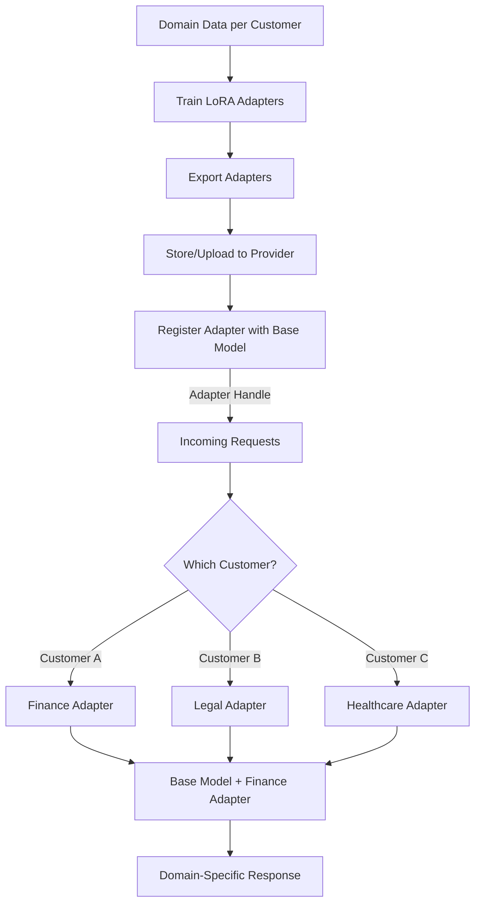

# LoRA-Adapter


Perfect 👍 — let’s make this **provider-neutral** so you can use it for **OpenAI, xAI, Anthropic, or any API-based LLM provider**.
Here’s a cleaned-up, **README-ready explanation with flowcharts and pipeline** (no Groq-specific details):

---

# 🚀 LoRAx-Style Adapters — Cost-Efficient Multi-Tenant LLM Deployment

## 📖 Overview

Serving **different customers/domains** usually means training and hosting **separate fine-tuned models**.
This is expensive 💸 — GPU memory, compute, and deployment complexity grow linearly with the number of customers.

**Solution:**
Use **LoRA (Low-Rank Adaptation)** adapters on a **single base model**. With **adapter hot-swapping**, you can specialize responses per customer without duplicating the full model.

---

## 🔑 Key Idea

* **1 Base Model** → shared across all customers
* **N LoRA Adapters** → one per customer/domain
* **Hot-swap LoRA adapters** → instantly specialize model behavior

💡 Example:

* Customer A → Finance adapter
* Customer B → Legal adapter
* Customer C → Healthcare adapter

---

## ⚙️ Pipeline

### 1. **Train LoRA Adapters**

* Start from a base model (`llama`, `gpt`, or `grok`).
* Fine-tune **LoRA adapters** on domain-specific data (finance/legal/etc.).
* Export adapters (`adapter_model.safetensors + config.json`).

---

### 2. **Package & Store**

* Bundle each adapter into a single artifact (`customerA.zip`).
* Upload to your model provider (OpenAI, xAI, Anthropic, or self-hosted inference server).

---

### 3. **Register with Base Model**

* Tell the provider:

  * Which **base model** (e.g., `llama-3`, `gpt-4`, `grok-1`).
  * Which **adapter to load**.
* Provider returns a **unique model ID** or lets you dynamically attach adapters at runtime.

---

### 4. **Inference with Adapters**

* At request time:

  * Pick the **correct adapter** based on customer/domain.
  * Call the provider API with the **base model + adapter ID**.
* Response is customized to the customer without reloading large weights.

---

## 📊 Flowchart



---

## 🧠 Benefits

* ✅ **90% Cheaper**: Avoid hosting multiple full models
* ✅ **Faster Training**: Only train lightweight adapters
* ✅ **Scalable**: Add new customers easily
* ✅ **Seamless Deployment**: Swap adapters dynamically

---

## 📌 Example Usage (Python, OpenAI/xAI Style)

```python
from provider import Client  # works like openai/xai/anthropic SDK
client = Client(api_key="YOUR_API_KEY")

completion = client.chat.completions.create(
    model="base-llm-with-customerA-adapter",  # base model + adapter
    messages=[
        {"role": "system", "content": "You are a finance assistant."},
        {"role": "user", "content": "Summarize today’s stock market trends."},
    ],
)

print(completion.choices[0].message.content)
```

---

## 🗂️ General Workflow

1. **Collect Data** → domain/customer-specific datasets
2. **Train Adapter** → LoRA fine-tuning
3. **Export & Package** → lightweight adapter files
4. **Register & Deploy** → attach adapter to base model
5. **Serve Inference** → dynamically select adapter per request

---

👉 This structure works for **any LLM provider** (OpenAI, xAI, Anthropic, or custom inference servers).

---

